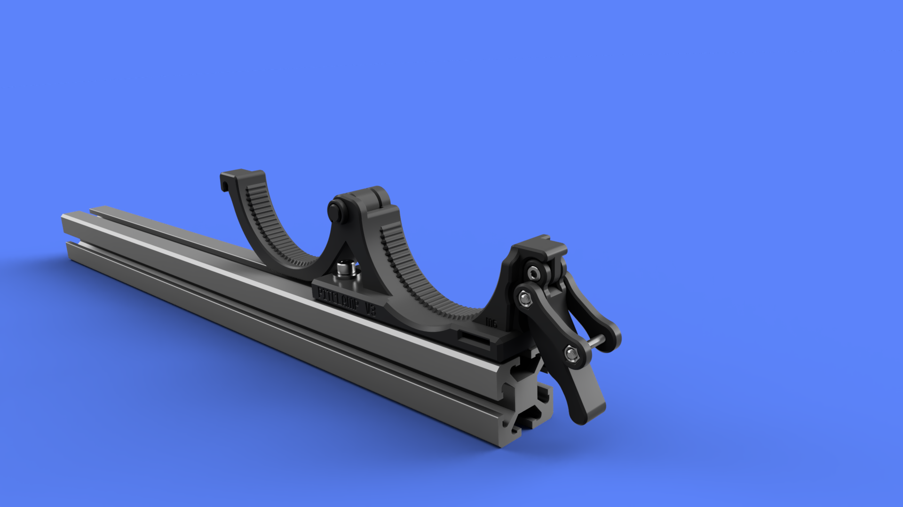

## PitClamp v3 - 4040 Base
  
  

**Summary**  
Base for attaching PitClamp v3 to 4040 aluminum extrusion  
60mm height when in 'storage' mode  

**File variations**  
- Ring Base M6 mounting hardware
- Ring Base M8 mounting hardware
    
**Hardware**  
- 2x M6x20 Socket Cap Head Bolt
- 2x ~12mm diameter M6 Washer (16mm max diameter, 2.4mm max thickness)
- 2x M6 T-Nut

**Printing**  
3 walls 30% infill  
(Must print with 0.2mm layer height for built-in support assists to work)  
Minimal supports around the hinge and handle attachment points  

**Assembly**  
Use M6x20 Socket Cap Head Bolt (or M8 on M8 version) and T-Nut to attach to 4040, washer for front slides into slot  
Attach Ring Upper to Ring Base using Hinge Pin and affix Hinge Pin Clip  

  
