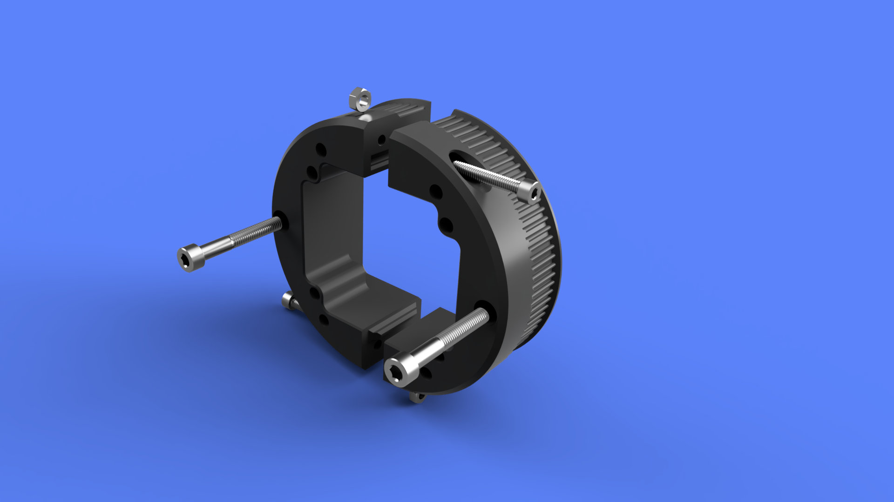

## PitClamp v3 - Motor Rings

  

**Summary**  
Motor rings for attaching iHSV57 and 57AIM Nema23 motors to PitClamp v3 mounts  

**File variations**  
- Motor_Ring_Half
  - Standard motor ring for iHSV57, AIM57 "Gold Motor", or other NEMA23
- Motor_Ring_Half_iHSV57-140w
  - Supports 140w motors with v2 reference board mounting support
  - Pair one of these with a standard half if you use 140w

**Hardware**  
- 2x M4x16 (M4x25 max) Socket Cap Head Bolt (w/ Optional 2x M4 Nut for added strength, likely unnecessary)
- 2x M5x35 (M5x50 max) Socket Cap Head Bolt (To attach to OSSM body)

**Printing**  
3 walls 20% infill  
No supports necessary  
(Must print with 0.2mm layer height for built-in support assists to work)  
If using 180w motor rings, print your selected ring twice; If using 140, replace one ring with the corresponding 140w variant  

**Assembly**  
(Optional, likely unnecessary) Insert M4 nut into each motor half slot  
Slide ring halves over motor and connect using M4x16 (M4x25 max) Socket Cap Head Bolt  
Connect motor ring assembly to OSSM Base using 2x M5x35 Socket Cap Head Bolts  
