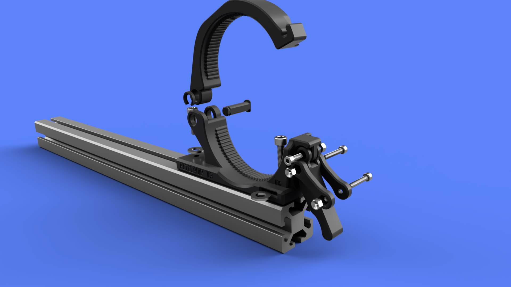
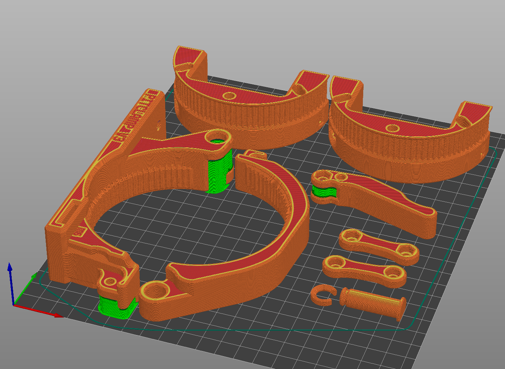

## PitClamp v3 - Shared Components

  

**Summary**  
Components shared among all PitClamp v3 mounting bases

**Part list**
- Ring Upper
- Hinge Pin
- Hinge Pin Clip
- Handle
- Dogbone (Nut inset)
- Dogbone (Bolt inset)

**Hardware**  
- 2x M4x25 Socket Cap Head Bolt
- 1x M4x12 Socket Cap Head Bolt
- 3x M4 Nut

**Printing**  
3 walls 30% infill  
(Must print with 0.2mm layer height for built-in support assists to work)  
Supports required for Handle  

**Assembly**  
Insert M4 nuts into the Dogbone and Handle  
Attach Handle to the Ring Base using M4x12 Socket Cap Head Bolt (Hand tighten until snug, then back off 1/4 turn)  
Attach Dogbones to the Handle using M4x25 Socket Cap Head Bolt (Hand tighten until snug, then back off 1/4 turn)  

  