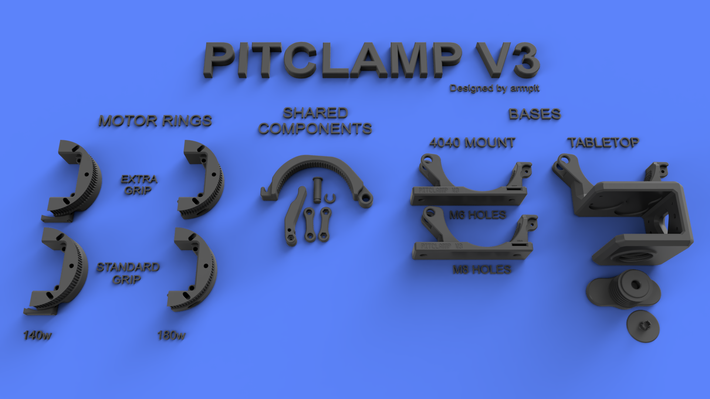
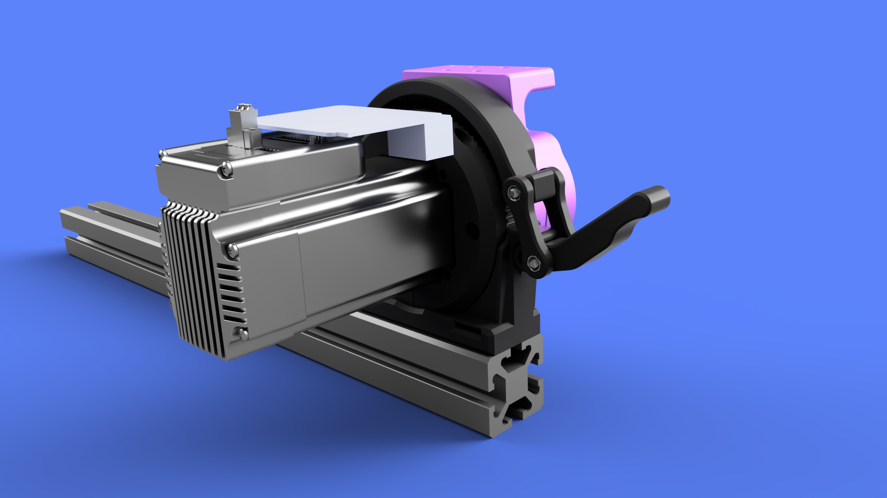
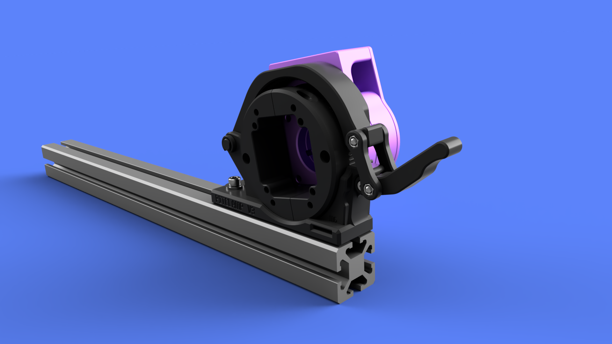
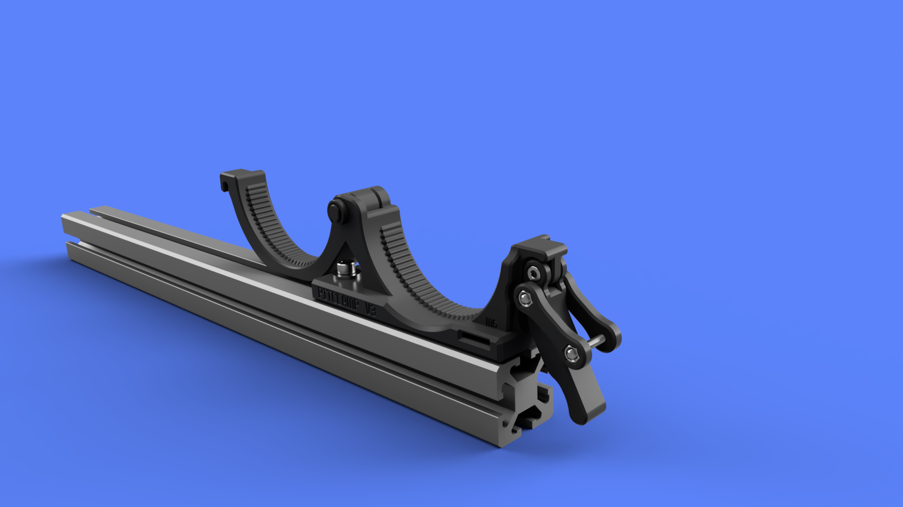
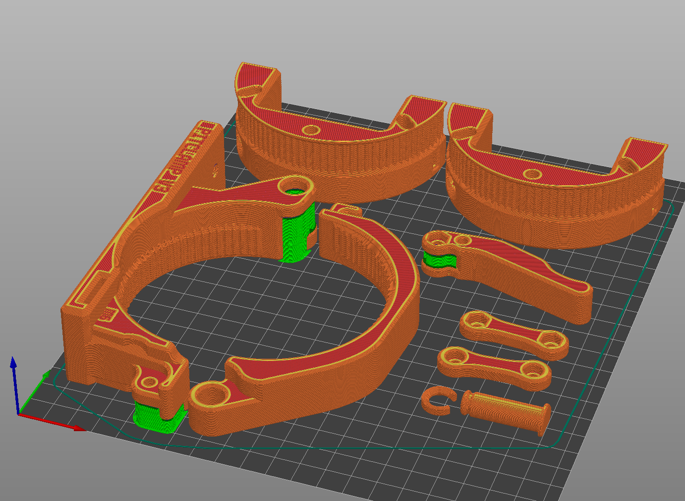
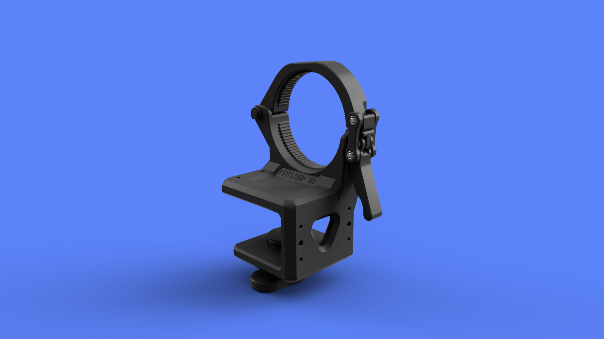
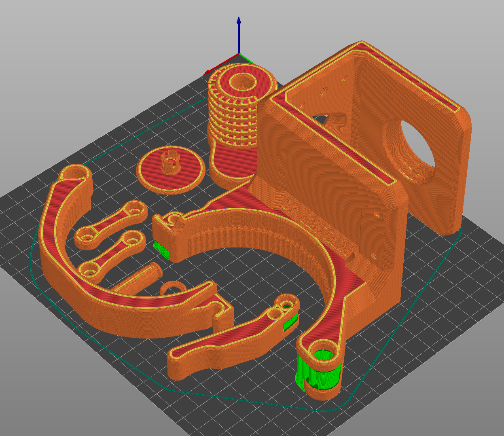

# Note: This project is obsolete. Use [PitClamp Mini](https://github.com/armpitMFG/PitClamp-Mini) instead

# PitClamp v3 Quick Release Nema23 Mount 
**Summary**  
Highly secure mounting and easy rotational adjustment of iHSV57 and 57AIM Nema23 motor  
Substantially stronger & grippier than previous PitClamp versions  
4 degree rotational granularity  
Supports sensor-homing cable passthrough  
Motor can be completely removed for storage  
Selection of bases for different use cases  

**Motor compatibility**  
- 180w JMC iHSV57 with v2 reference board  
  - Full 360 degree range of movement
- 140w JMC iHSV57 with v2 reference board
  - 80 degree (-40 to 40 from horizontal)
- 140w JMC iHSV57 with relocated (or future) reference board
  - Full 360 degree
- 100w JMC iHSV57 with v2 reference board
  - Not supported
- 100w JMC iHSV57 with relocated (or future) reference board
  - 200 degree (-100 to 100 from horizontal) 
- "Gold motor" 57AIM30C with relocated (or future) reference board
  - Full 360 degree

  

## [PitClamp v3 - Motor Rings](Files/Motor%20Rings)
  

**Summary**  
Motor rings for attaching iHSV57 and 57AIM Nema23 motors to PitClamp v3 mounts  

**File variations**  
- EXTRAGRIP
  - Clunkier adjustment, but provides extra grip strength
  - Not recommended unless you have grip issues with the standard
- 140w
  - Supports 140w motors with v2 reference board mounting support
  - Pair one of these with a standard half if you use 140w

**Part list**  
- Motor Ring Half
- Motor Ring Half EXTRAGRIP
- Motor Ring Half 140w
- Motor Ring Half EXTRAGRIP 140w

**Hardware**  
- 2x M4x16 (M4x25 max) Socket Cap Head Bolt (w/ Optional 2x M4 Nut for added strength, likely unnecessary)
- 2x M5x35 (M5x50 max) Socket Cap Head Bolt (To attach to OSSM body)

**Printing**  
3 walls 20% infill  
No supports necessary  
(Must print with 0.2mm layer height for built-in support assists to work)  
If using 180w motor rings, print your selected ring twice; If using 140, replace one ring with the corresponding 140w variant  

**Assembly**  
(Optional, likely unnecessary) Insert M4 nut into each motor half slot  
Slide ring halves over motor and connect using M4x16 (M4x25 max) Socket Cap Head Bolt  
Connect motor ring assembly to OSSM Base using 2x M5x35 Socket Cap Head Bolts  

## [PitClamp v3 - Shared Components](Files/Shared%20Components/)
  

**Summary**  
Components shared among all PitClamp v3 mounting bases

**Part list**
- Ring Upper
- Hinge Pin
- Hinge Pin Clip
- Handle
- Dogbone (Nut inset)
- Dogbone (Bolt inset)

**Hardware**  
- 2x M4x25 Socket Cap Head Bolt
- 1x M4x12 Socket Cap Head Bolt
- 3x M4 Nut

**Printing**  
3 walls 30% infill  
(Must print with 0.2mm layer height for built-in support assists to work)  
Supports required for Handle  

**Assembly**  
Insert M4 nuts into the Dogbone and Handle  
Attach Handle to the Ring Base using M4x12 Socket Cap Head Bolt (Hand tighten until snug, then back off 1/4 turn)  
Attach Dogbones to the Handle using M4x25 Socket Cap Head Bolt (Hand tighten until snug, then back off 1/4 turn)  

  

## [PitClamp v3 - 4040 Base](Files/Bases/40-4040)
  
  

**Summary**  
Base for attaching PitClamp v3 to 4040 aluminum extrusion  
60mm height when in 'storage' mode  

**File variations**  
- Ring Base M6 mounting hardware
- Ring Base M8 mounting hardware
  
**Hardware**  
- 2x M6x20 Socket Cap Head Bolt
- 2x ~12mm diameter M6 Washer (16mm max diameter, 2.4mm max thickness)
- 2x M6 T-Nut

**Printing**  
3 walls 30% infill  
(Must print with 0.2mm layer height for built-in support assists to work)  
Minimal supports around the hinge and handle attachment points  

**Assembly**  
Use M6x20 Socket Cap Head Bolt (or M8 on M8 version) and T-Nut to attach to 4040, washer for front slides into slot  
Attach Ring Upper to Ring Base using Hinge Pin and affix Hinge Pin Clip  

  

## [PitClamp v3 - Tabletop Base](Files/Bases/Tabletop/)  

  

**Summary**  
Allows for clamping to a tabletop, door or similar, ranging from 30mm-50mm  
For use with stroker attachments or for light-duty insertable use when attached to an interior door  

**Hardware**  
38mm furniture non-slip pads. Inexpensive, ~$3USD local or Amazon for 8pc.  
https://www.scotchbrand.com/3M/en_CA/p/d/v000277260/  

**Printing**  
3 walls, 30% infill minimum; More walls for stiffer clamp  
(Must print with 0.2mm layer height for built-in support assists to work)  
Minimal supports around the hinge and handle attachment points, but for cleaner threads you can use support there, too  
I chose not to support threads and worked fine on Ender3 v1 w/ PETG  
The screw and screw topper do not need support  

**Assembly**  
(Optional, but highly recommended) Attach 3 furniture gripping pads to the underside of the Tabletop Mount and 1 gripping pad to Screw Topper.  
Thread Screw through the Tabletop Mount and then snap Screw Topper into place

**Addons**  
M4,M6,M4 holes with 15mm spacing on center to support addons  
Currently no add-ons have been created  

  
